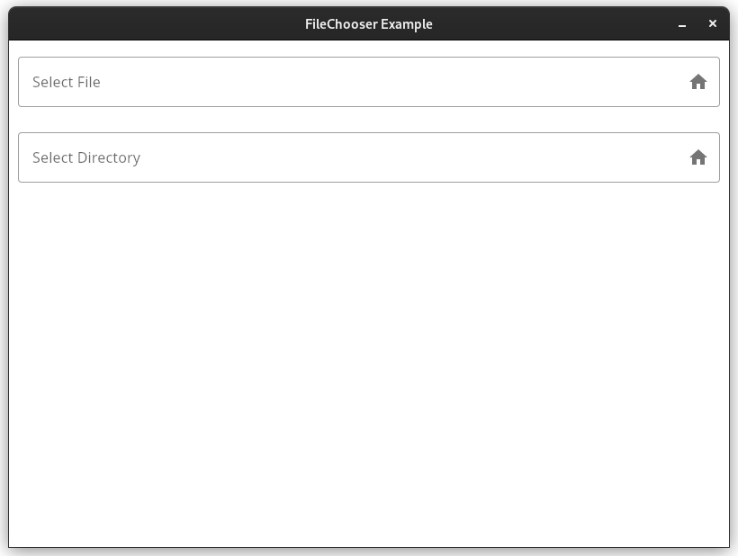
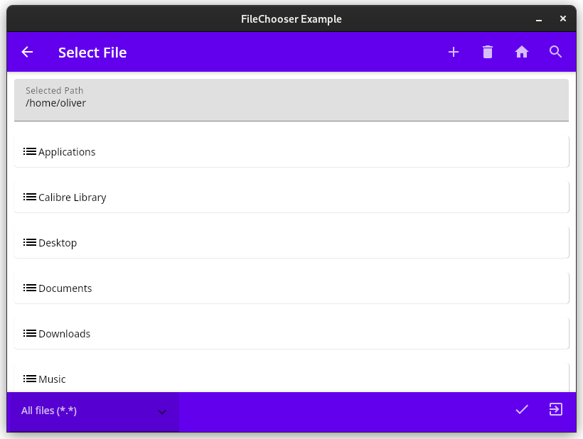
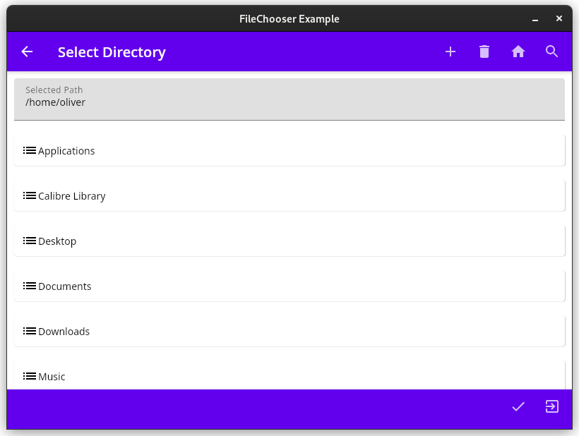

# compose-fileChooser

Minimal application containing a file chooser for Compose.

## Overview

### Main View

The main window consists of two text fields with trailing icons.
Clicking the upper icon will open a file chooser with filters related
to text files. The lower icon opens a directory chooser.

### File Chooser

The file chooser will display all subdirectories and matching file types 
in the current directory. The text field in the upper part of the dialog 
displays the currently selected path. This text field can also be used to 
type in a path manually, the navigation of the list will follow automatically.

The top bar contains the following actions (from left to right):

* **Arrow Back:** navigate to the current directory's parent
* **Plus:** add new file or directory (depending on the `FileChooserMode`)
  * Button is enabled in all directories with writing access
  * If the entered parent folders do not exist, they are created
* **Trashcan:** delete selected file (not yet implemented)
  * Button is enabled for all directories with writing access, accept the user's home directory 
* **Home:** Returning to user's home directory
* **Magnifying Glass:** toggle invisible files and directories (with leading dot in their name)

In the bottom bar there are three options available:

* selecting the file type (default should be _All files (\*.\*)_)
* applying the selection (check mark) will close the dialog and return to the main view
* cancelling the selection will return to the main view without selecting the path.

### Directory Chooser

The directory chooser works in a similar fashion as the file chooser, accept for the 
missing file filter.

## How to use

**TODO**
